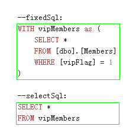

  
# ExpansionPack :: PagingQuery 
 
This expansion pack is focus on paging query.  

*The root section of documents of **all optional expansion packs**, please visit [here](/MicroDBHelper-ExpansionPack/).*


## Environmental Requirement
* .Net framework 4.5 and +


## Dependencies 
* [MicroDBHelper](/MicroDBHelper/)
* [MicroDBHelper-ExpansionPack-EntityConversion](/MicroDBHelper-ExpansionPack/EntityConversion)


## Usage

### Result container 
Firstly, let us see the result models,  `PagingResult` and `PagingResult<T>`.  

The former include **DataTable object** result, the latter include **entity list of target type** result.  

|   | PagingResult | PagingResult&lt;T&gt; |
| ------| ------ | ------ |
| .Datas | DataTable | IList&lt;T&gt; |
| .CurrentPageIndex | Current Index | Current Index |
| .PageSize | Size of per Page | Size of per Page |
| .TotalItemsCount | Count of all items | Count of all items |
| .TotalPages | Count of all pages | Count of all pages |


### Call query method 
#### Paging datas by Database
There are two alternatives in **MicroDBHelpers.ExpansionPack.PagingQuerier** static class : 
* `PagingAsDatatable` and `PagingAsDatatableAsync`. This will return `PagingResult` (DataTabel result in **Datas** property);
 
* `PagingAsEntity` and `PagingAsEntityAsync`. This will return `PagingResult<T>` (entity list of target type in **Datas** property), **note** that you need to reference [EntityConversion](/MicroDBHelper-ExpansionPack/EntityConversion/) when you choose this alternative ;
 
 
There are some key parameters in these query methods:
* **pageIndex** and **pageSize**. Indicate how you want to paginate. 

  *BTW, it's useful that you can pass a big number to **pageSize** (such as int.MaxValue) in order to get all datas in some scenes.*

* **fixedSql**. If your SQL expression include somethings that front before SELECT (such as CTE, Variable definitions, etc. ) then you can put them in this parameter； if not include, just pass String.Empty;
 
* **selectSql**. It is the core part of your SELECT expression. The library requires it to contain **SELECT** and **FROM*** keywords, **ORDER BY** is Optional.

More about **fixedSql** and  **selectSql** : 



#### Directly paging entities In Memory
This is *Just a helper function* for developers who hope to "Paging Datas in Memory" and use the "PagingResult Model",it is in **MicroDBHelpers.ExpansionPack.PagingQuerier** static class. 

```
//Method definition：
PagingResult<T> PagingByList<T>(IEnumerable<T> datas, int pageIndex, int pageSize);
```

 
  
## Notes & Recommend
The Core logic of Paging Query is *to change the T-SQL, SELECT the total count of results, and SELECT the datas PART of them thanks to ROW_NUMBER function*. So in fact, the origin T-SQL you pass into the method cannot be very complex, it's a hard work to deal all of the complex situations. 

:) However, there are some recommends that can make it work fine: 
* Avoid using subqueries in the **selectSql**. Convert it by using JOIN logic.  
* Put your complex situation to the **fixedSql** and use CTE. This will improve the readability, performance and this part will not participat in *change T-SQL for Paging* so it will be much strong. 
  


## Download compiled binary file
If you needn't to got the code and bulid by yourself for the moment, I also offer the newest compiled file in the BUILD directiory for your convenience. 

[Build Directory](https://github.com/DoraemonYu/MicroDBHelper-ExpansionPack/tree/master/Build)


## NuGet 
`Install-Package MicroDBHelper-ExpansionPack-PagingQuery`  [link](https://www.nuget.org/packages/MicroDBHelper-ExpansionPack-PagingQuery/)

<br><br><br>
o(∩_∩)o *The root section of documents of **all optional expansion pack**, please visit [here](/MicroDBHelper-ExpansionPack/).*
