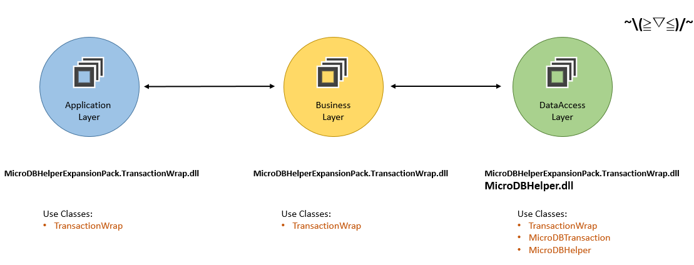

  
# ExpansionPack :: TransactionWrap 
 
This expansion pack is focus on "Assembly Decoupling". Allow assemblys that are hierarchical design, conveniently to create Transaction Object, without Reference the *"MicroDBHelper.dll"*.  
 
It's useful for those **hierarchical design projects**, and there is no value for *non-hierarchical projects*, please make sure your needs. 

*The root section of documents of **all optional expansion packs**, please visit [here](/MicroDBHelper-ExpansionPack/).*

## Environmental Requirement
* .Net framework 2.0 and +
 
  
  
## Background 
MicroDBHelper offer friendly interfaces to use DBHelper, and offer Transaction Support as well. **All of them** are packaged in the single *"MicroDBHelper.dll"* . After reference it, you can use it anywhere.   

However, when you use it in a **hierarchical design** project, then you will face some closure problem.  
  
   
   
For excample ( an 3-tier architecture project ):  
  
We keep the database's logics ONLY in the *DataAccess Layer*, but may allow Transaction Begin in *Business Layer*, even *Application Layer* ( according to actual needs ) .   

As you see, due to the " All of them are packaged in the single dll", you SHOULD reference it again in *Business Layer* and up layers, JUST in order to use *MicroDBTransaction*.  

Maybe we can solve this problem by some design patterns or development agreements, but it's not very rigorous for the **Closures Principle**, isn't it?  

Therefore, library offer a solution with assembly-level to solve it. Let us look this:  
   
Now, we use an wrapper from this expansion pack to instead of *MicroDBTransaction* by *"MicroDBHelper.dll"*. It just an wrapper, no more logics in it and just make the assemblys to be decoupling.  

*Business Layer* and up layers use *TransactionWrap* type ; Public interfaces from *DataAccess Layer* also use *TransactionWrap* type, and use *MicroDBTransaction* type inner and finally invoke with *MicroDBHelper* class, library will automatically identify *TransactionWrap* as *MicroDBTransaction* .

## Usage

### Implicit conversion 
:) **Just feel free** to use *TransactionWrap*.   
Because of library will automatically identify *TransactionWrap* as *MicroDBTransaction*.   
  
So firstly, all the usages with properties and methods in *TransactionWrap* is same as those in *MicroDBTransaction* ( [link](https://doraemonyu.github.io/MicroDBHelper/#transaction) ) ; Secondly, you could just pass the *TransactionWrap* instance to those methods that is define *MicroDBTransaction* type parameter without any manual conversion.

### Begin transaction
The **tiny** difference in code is that when begin Transaction, instead of *TransactionWrap.UseTransaction* by *MicroDBHelper.UseTransaction*. ( We can change these codes smoothly with the bulk text replacement tool.  )

 
  
## Notes & Recommend
This expansion pack was an wrapper and finally call logics in *"MicroDBHelper.dll"* as well.   
So just one thing to do is, make sure that assemblies of current AppDomain MUST at least one reference the *"MicroDBHelper.dll"*.   

Like the example above, *DataAccess Layer*  is part of the AppDomain and reference *"MicroDBHelper.dll"* , then other layers who use the wrap whitout reference *"MicroDBHelper.dll"* wolud still work properly.

## Download compiled binary file
If you needn't to got the code and bulid by yourself for the moment, I also offer the newest compiled file in the BUILD directiory for your convenience. 

[Build Directory](https://github.com/DoraemonYu/MicroDBHelper-ExpansionPack/tree/master/Build)

## NuGet 
`Install-Package MicroDBHelper-ExpansionPack-TransactionWrap`  [link](https://www.nuget.org/packages/MicroDBHelper-ExpansionPack-TransactionWrap/)

   
o(∩_∩)o *The root section of documents of **all optional expansion pack**, please visit [here](/MicroDBHelper-ExpansionPack/).*
